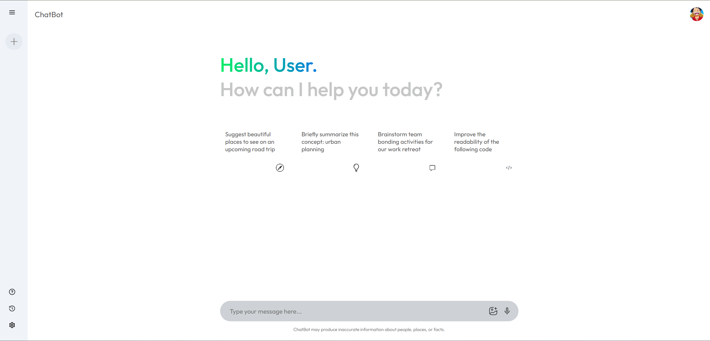

# 🤖 AI ChatBot Application

A modern, intelligent full-stack chatbot application powered by the **Google Gemini API**, built with **React**, **Vite**, **Express**, **MongoDB** and **Tailwind CSS**. This conversational AI assistant provides context-aware responses and delivers an intuitive user experience.



---

## ✨ Features

- 💬 **Intelligent Conversations** – Powered by Google Gemini API for context-aware responses
- 🎨 **Modern UI/UX** – Clean, minimalist design with smooth animations
- 📱 **Fully Responsive** – Optimized for desktop, tablet, and mobile devices
- 🚀 **Fast Performance** – Built with Vite for instant hot module replacement
- 💾 **Database & History** – Persistent conversation tracking with MongoDB
- 🎯 **Quick Actions** – Predefined prompts for common queries
- 🔊 **Voice Input** – Support for voice-to-text functionality
- 📸 **Image Support** – Ability to process and respond to image uploads
- 🔐 **Authentication** – Secure user login and registration

---

## 🚀 Tech Stack

| Component | Technology |
|-----------|------------|
| **Frontend** | React, Vite, Tailwind CSS, Context API |
| **Backend** | Node.js, Express.js |
| **Database** | MongoDB & Mongoose |
| **AI Integration** | Google Gemini API (`@google/generative-ai`) |
| **Authentication** | JWT, bcryptjs |

---

## 📁 Project Structure

```
chatbot/
├── frontend/                 # React + Vite Front-end application
│   ├── public/               # Static assets
│   ├── src/
│   │   ├── assets/           # Images, icons
│   │   ├── components/       # React UI components
│   │   ├── Config/           # API Configuration (Gemini)
│   │   ├── Context/          # React Context (State Management)
│   │   ├── utils/            # Utilities and helpers
│   │   ├── App.jsx           # Main application wrapper
│   │   └── main.jsx          # Application entry point
│   ├── index.html            # Vite HTML template
│   ├── package.json          # Frontend dependencies
│   ├── tailwind.config.js    # Tailwind CSS configuration
│   └── vite.config.js        # Vite configuration
├── backend/                  # Express + Node.js Back-end application
│   ├── middleware/           # Express middlewares (e.g., auth check)
│   ├── models/               # Mongoose schemas and models
│   ├── routes/               # API endpoint definitions
│   ├── server.js             # Main backend application entry point
│   └── package.json          # Backend dependencies
├── api/                      # Optional Vercel serverless function entrypoints
├── .env                      # Environment variables mapping for Vercel (optional)
├── package.json              # Root workspace manager
├── README.md                 # Project documentation
├── start-all.bat             # Batch script to start full-stack locally
├── start-frontend.bat        # Batch script to start only frontend
└── start-backend.bat         # Batch script to start only backend
```

---

## 🛠️ Installation & Setup

### Prerequisites
- Node.js (v18 or higher)
- npm or yarn
- Google Gemini API Key
- MongoDB URI

### Steps

1. **Clone the repository**
```bash
git clone https://github.com/kaushalkr585-cmd/ai-chatbot.git
cd ai-chatbot
```

2. **Install all dependencies**
Navigate to the root and run the bulk installer which will install dependencies for both frontend and backend:
```bash
npm run install-all
```

3. **Configure environment variables**

   **Frontend Configuration:**
   Create a `.env` file in the `frontend/` directory:
```env
VITE_GEMINI_API_KEY=your_gemini_api_key_here
```
   Get your API key from [Google AI Studio](https://makersuite.google.com/app/apikey)

   **Backend Configuration:**
   Create a `.env` file in the `backend/` directory:
```env
PORT=5000
MONGODB_URI=your_mongodb_connection_string
JWT_SECRET=your_jwt_secret_key
```

4. **Start the application**
You can start both frontend and backend concurrently from the root directory:
```bash
npm run dev
```

Alternatively, you can run them via the provided batch scripts (Windows) such as `start-all.bat`.

5. **Open in browser**
```
http://localhost:5173
```

---

## 🔧 Available Scripts

At the **root folder**, the following commands are available:
| Command | Description |
|---------|-------------|
| `npm run dev` | Start both frontend & backend concurrently |
| `npm run install-all` | Install frontend & backend dependencies |
| `npm run frontend` | Start only the React frontend |
| `npm run backend` | Start only the Express backend |

---

## 📦 Build & Deploy

### Deployment Options
- **Frontend**: Deploy `frontend/` to Vercel, Netlify, or Cloudflare Pages. Make sure the build command is `npm run build` and publish directory is `dist`.
- **Backend / Database**: Can be deployed to Render, Railway, or Heroku. Make sure to supply MongoDB URI and JWT Secret securely in the deployment host as environment variables.

---

## 👨‍💻 Author & Contact

**Kaushal Kumar**  
Full Stack Developer  
React  • JavaScript • Node.js • Express • MongoDB  

📧 Email: kaushalkr.585@gmail.com   
🔗 LinkedIn: https://www.linkedin.com/in/kaushal-kumar-1a0370377/  
🐱 GitHub: https://github.com/kaushalkr585-cmd/  

---

<div align="center">
  <p>Built with ❤️ using React, Node.js & Google Gemini API</p>
  <p>© 2026 Kaushal Kumar. All rights reserved.</p>
</div>
